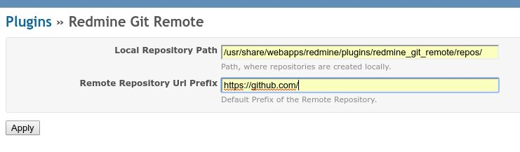

redmine_git_remote
==================

Redmine plugin to automatically clone and remote git repositories.

## Installation

Install the plugin as usual:

```
cd REDMINE_ROOT/plugins
git clone https://github.com/dergachev/redmine_git_remote
```

Then enable the new GitRemote SCM type in [http://redmine-root/settings?tab=repositories](http://redmine-root/settings?tab=repositories)


The plugin shells out to the following binaries, so make sure they're available:
* git 1.7.5+ - a version recent enough to support `get remote add --mirror=fetch origin URL`
* ssh-keyscan
* ssh-keygen

## Supporting private repos

For security sake, we don't support cloning over HTTPS with username password, but only via SSH.

For example:

* This private repo will fail to clone: `https://github.com/dergachev/my-secret-repo`
* Instead, use the SSH form: `git@github.com:evolvingweb/my-secret-repo.git`

If you're going to use the SSH form, you'll need to install the appropriate SSH
keys to `~/.ssh/id_rsa` (in the home directory of your redmine webserver user,
likely www-data).

Some extra tips:

* For GitHub/GitLab, we have found it too troublesome to install repository-specific SSH keys.
  Instead we ended up creating recommend creating a
  [dedicated account for redmine](https://developer.github.com/guides/managing-deploy-keys/#machine-users)
  and installing the keys there.
* On Ubuntu, the `www-data` user's $HOME is `/var/www`, and by default it's owned by root.
  That means you might have to do this before installing Redmine: `sudo mkdir /var/www/.ssh; sudo chown www-data:www-data /var/www/.ssh`

## Configuration

The plugin offers two configuration options:

* Local Repository Path (git_local_path) - Path, where repositories are created on the local system. This defaults to `REDMINE_PLUGINS_PATH/redmine_git_remote/repos`.
* Remote Repository Url Prefix - Default Prefix of the Remote Repository. The Default Prefix for Remote Repositories, defaults to an empty value. If this value is set, this prefix is shown in the Clone URL field of a repository by default, but can be overwritten by the user (eg. https://github.com/).



The above configuration can be found at `Administration -> Plugins -> Redmine Git Remote -> Config`. Furthermore for initial values, the file `redmine_git_remote/conf/settings.yml` can be used.

## Usage

This plugin defines a new repository type, GitRemote, which allows you to associate
a remote repository with your Redmine project. First create a new repository of type
GitRemote, enter the clone URL. The identifier and path will be auto-generated, but can be overriden.


On submitting the repository creation form, the identifier and `url`
(filesystem path) fields will be auto-generated (if not explicitly provided).

For example, if you enter `https://github.com/dergachev/vagrant-vbox-snapshot` as the Clone URL,
it will prefill the Identifier and filesystem path fields as follows:
* Identifier: `vagrant-vbox-snapshot`
* Path: `REDMINE_PLUGINS_PATH/redmine_git_remote/repos/github.com/dergachev/vagrant-vbox-snapshot` (Note: The Path can be configured using the above mentioned method, but can also be entered for each repository.)

Once the remote URL is validated, the plugin creates an [empty clone](http://stackoverflow.com/questions/895819/whats-the-most-straightforward-way-to-clone-an-empty-bare-git-repository) at the specified path.

This plugin hooks into the core `Repository.fetch_changesets` to automatically
run `git fetch --all` on all GitRemote managed repositories as Redmine is about
to pull in changesets from the local repos.

To avoid slowing down the GUI, we recommend unchecking the "Fetch commits
automatically" setting at
[http://redmine-root/settings?tab=repositories](http://redmine-root/settings?tab=repositories)
and relying on the following cron job as per [Redmine Wiki Instructions](http://www.redmine.org/projects/redmine/wiki/RedmineRepositories):

```
*/5 * * * * cd /home/redmine/redmine && ./script/rails runner Repository.fetch_changesets -e production >> log/cron_rake.log 2>&1
```

To trigger fetch manually, run this:

```
cd /home/redmine/redmine && ./script/rails runner "Repository.fetch_changesets" -e production
```

Notes:

* Tested on Redmine 2.6 and ruby 2.1
* Tested on Redmine 3.3.1
* Currently alpha state, use at your own risk. Given possible security risks of shelling out,
  we recommend using this plugin only if all RedMine project admins are trusted users.
* This plugin doesn't clean-up (delete) cloned repos from the file system when the record
  is deleted from Redmine.
* Currently Redmine will crash if this plugin is uninstalled, as rails can't
  seem to handle model classes disappearing while db records reference them.
  This snippet should make the error go away:

    ```
    ./script/rails runner 'ActiveRecord::Base.connection.execute("UPDATE repositories SET type=\"Repository::Git\" WHERE type = \"Repository::GitRemote\")' -e production
    ```
